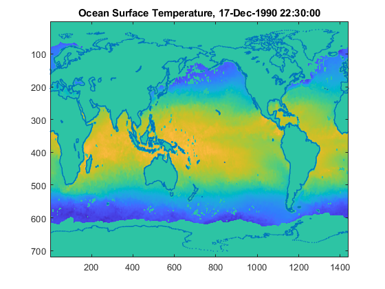

# Programming: Structuring Code

 or 

**Curriculum Module**

_Created with R2021b. Compatible with R2021b and later releases._

# Information

This curriculum module contains interactive [MATLAB® live scripts](https://www.mathworks.com/products/matlab/live-editor.html) that  teach fundamental concepts and basic terminology related to programming computers. This module focuses on organizing code into functions, describing, debugging, and sharing code.

## Background

You can use these live scripts as demonstrations in lectures, class activities, or interactive assignments outside class. This module covers using built-in and user-defined functions, commenting code and choosing variable names, utilizing warning messages and run-time errors to locate and fix bugs, comparing different versions of a script, cloning a GitHub repository, and creating a MATLAB project. 

The instructions inside the live scripts will guide you through the exercises and activities. Get started with each live script by running it one section at a time. To stop running the script or a section midway (for example, when an animation is in progress), use the  Stop button in the **RUN** section of the **Live Editor** tab in the MATLAB Toolstrip.

## Contact Us

Solutions are available upon instructor request. Contact the [MathWorks teaching resources team](mailto:onlineteaching@mathworks.com) if you would like to request solutions, provide feedback, or if you have a question.

## Prerequisites

This module assumes familiarity with basic programming concepts such as floating point doubles and strings, structures including constants, vectors, matrices, and arrays, and control flows including if/else, for loops, and while loops, as well as how to use them in MATLAB. These ideas are all presented with interactive examples in [<u>Fundamentals of Programming</u>](https://www.mathworks.com/matlabcentral/fileexchange/103225-fundamentals-of-programming).

## Getting Started
### Accessing the Module
### **On MATLAB Online:**

Use the  link to download the module. You will be prompted to log in or create a MathWorks account. The project will be loaded, and you will see an app with several navigation options to get you started.

### **On Desktop:**

Download or clone this repository. Open MATLAB, navigate to the folder containing these scripts and double-click on [StructuringCode.prj](https://matlab.mathworks.com/open/github/v1?repo=MathWorks-Teaching-Resources/Programming-Structuring-Code&project=StructuringCode.prj). It will add the appropriate files to your MATLAB path and open an app that asks you where you would like to start. 

Ensure you have all the required products ([listed below](#H_E850B4FF)) installed. If you need to include a product, add it using the Add-On Explorer. To install an add-on, go to the **Home** tab and select   **Add-Ons** > **Get Add-Ons**. 

## Products

MATLAB®

# Scripts
## [**Functions.mlx**](https://matlab.mathworks.com/open/github/v1?repo=MathWorks-Teaching-Resources/Programming-Structuring-Code&project=StructuringCode.prj&file=Scripts/Functions.mlx) 
| `Functions` | **In this script, students will...** | **Summary**  |
| :-- | :-- | :-- |
|  | -  use mathematical functions to use MATLAB as a calculator.  -  use the documentation to locate functions and determine how to use them.  -  write simple functions with inputs, outputs, and side effects, and ensure the functions are on your MATLAB path.  -  pass functions as arguments by using function handles. | Organizing code into functions improves the readability, reusability, and ease of testing. This script addresses built-in functions, refactoring code to create functions, local functions, functions defined in their own files, programmatic scope and the MATLAB path, and how to pass functions as arguments to other functions.  |

## [**Debugging.mlx**](https://matlab.mathworks.com/open/github/v1?repo=MathWorks-Teaching-Resources/Programming-Structuring-Code&project=StructuringCode.prj&file=Scripts/Debugging.mlx) 
| `Debugging` | **In this script, students will...** | **Summary**  |
| :-- | :-- | :-- |
|  | -  identify warning messages and locate and fix the problem.  -  locate and fix syntax errors.  -  recognize and isolate run-time errors. | Everyone makes mistakes when coding or interacting with computer programs, but you can fix these mistakes. This script introduces the MATLAB Code Analyzer, errors, warnings, breakpoints, stepping, and other tools for minimizing errors as well as identifying and removing bugs from your programs.  |

## [**CommentingCode.mlx**](https://matlab.mathworks.com/open/github/v1?repo=MathWorks-Teaching-Resources/Programming-Structuring-Code&project=StructuringCode.prj&file=Scripts/CommentingCode.mlx) 
| `Commenting Code` | **In this script, students will...** | **Summary**  |
| :-- | :-- | :-- |
|  | -  write comments and documentation for a self-defined function.  -  select meaningful variable names and add code and documentation to an existing function. | Clearly documenting and communicating your thinking is essential to program with others or even your future self. This script addresses why and how you should document and comment your code.  |

## [**SharingCode.mlx**](https://matlab.mathworks.com/open/github/v1?repo=MathWorks-Teaching-Resources/Programming-Structuring-Code&project=StructuringCode.prj&file=Scripts/SharingCode.mlx) 
| `Sharing Code` | **In this script, students will...** | **Summary**  |
| :-- | :-- | :-- |
|  | -  add scripts to a project.  -  clone a GitHub repository.  -  use the Compare tool to see differences between two versions of the same live script | Writing code for yourself is the first step, but when you create something useful or interesting, you also need to know how to share your work with others. This script offers a brief introduction to sharing your code with others.  |

# License

The license for this module is available in the [LICENSE.md](https://github.com/MathWorks-Teaching-Resources/Programming-Structuring-Code/blob/release/LICENSE.md).

# Related Courseware Modules
| **Courseware Module** | **Sample Content** | **Available on:**  |
| :-- | :-- | :-- |
| [**Programming: Organizing Data**](https://www.mathworks.com/matlabcentral/fileexchange/115900-programming-organizing-data)  Learn more about strings, numeric data types, memory, and ways of storing data |  |   [GitHub](https://github.com/MathWorks-Teaching-Resources/Programming-Organizing-Data)  |
|  [**Programming: A Starter Project Using MATLAB and Python**](https://www.mathworks.com/matlabcentral/fileexchange/116490-programming-a-starter-project-using-matlab-and-python)  Use MATLAB, Python, and the OpenWeather API together to implement a weather prediction dashboard |  |    [GitHub](https://github.com/MathWorks-Teaching-Resources/Programming-A-Starter-Project-Using-MATLAB-and-Python)  |
| | |

**Introductory content:**

-  [**Fundamentals of Programming**](https://www.mathworks.com/matlabcentral/fileexchange/103225-fundamentals-of-programming) is available on  or  or [GitHub](https://github.com/MathWorks-Teaching-Resources/Fundamentals-of-Programming) 
-  [**Treasure Hunt Game: Learn to Code**](https://www.mathworks.com/matlabcentral/fileexchange/123265-treasure-hunt) is available on  or  or [GitHub](https://github.com/MathWorks-Teaching-Resources/Treasure-Hunt) 

Or feel free to explore our other [modular courseware content](https://www.mathworks.com/matlabcentral/fileexchange/?q=tag%3A%22courseware+module%22&sort=downloads_desc_30d).

# Educator Resources
-  [Educator Page](https://www.mathworks.com/academia/educators.html) 

# Contribute 

Looking for more? Find an issue? Have a suggestion? Please contact the [MathWorks teaching resources team](mailto:%20onlineteaching@mathworks.com). If you want to contribute directly to this project, you can find information about how to do so in the [CONTRIBUTING.md](https://github.com/MathWorks-Teaching-Resources/Programming-Structuring-Code/blob/release/CONTRIBUTING.md) page on GitHub.

 *©* Copyright 2023 The MathWorks™, Inc

